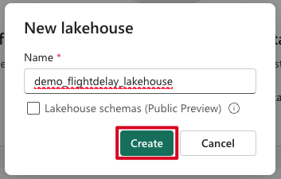
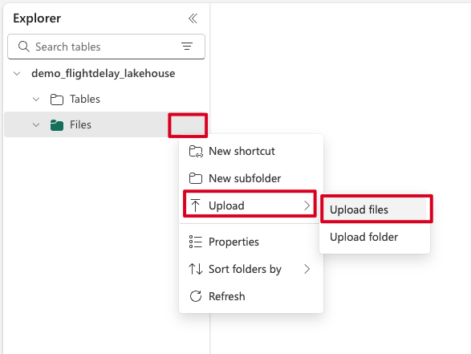
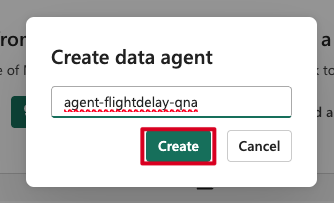

# Flight Delay Prediction Lab Guide (Microsoft Fabric)

This guide provides step-by-step instructions on using Copilot and other AI tools within Microsoft Fabric to build an end-to-end flight delay prediction solution. Visitors can follow these instructions to learn how to effectively leverage AI capabilities in Microsoft Fabric.

### Repository: `fabric-flight-ai-demo`

---

## Step 0: Create Workspace

First, you need to create a Microsoft Fabric workspace:

1. **Navigate to workspaces and click "New workspace"**:


- Go to Microsoft Fabric homepage
- Click on **Workspaces** in the left navigation
- Click **+ New workspace** at the bottom

2. **Fill in workspace details**:


- Name it: `fabric-flight-ai-demo` (or your preferred name)
- Add description: "Flight delay prediction demo using Microsoft Fabric AI tools"
- Click **Apply**

3. **Create Lakehouse**:

**Step 1: Select Lakehouse from New Item**


- In your new workspace, click **+ New item**  
- Search for "lakehouse" and select **Lakehouse**

**Step 2: Name the Lakehouse**



- Name it following naming convention: `<prefix>_flightdelay_lakehouse` (e.g., `demo_flightdelay_lakehouse`)
- Note: Names can only include numbers, letters, and underscore (_)
- Click **Create**

---

## Step 1: Upload CSV to Lakehouse

- Download the dataset from Kaggle: [Flight Delay and Cancellation Dataset (2019–2023)](https://www.kaggle.com/datasets/patrickzel/flight-delay-and-cancellation-dataset-2019-2023)

**Step 1: Navigate to Files and Upload**



- Go to your Lakehouse > **Files** 
- Right-click on **Files** or use the menu
- Select **Upload** > **Upload files**

**Step 2: Upload the CSV File**


- Select or drag the `flights_sample_3m.csv` file
- Check "Overwrite if files already exist" if needed
- Click **Upload**

---

## Step 2: Dataflow Gen 2 – Clean & Transform

### Create Dataflow:

**Step 1: Create New Dataflow Gen2**


- Go to workspace > **+ New item**
- Search for "datafl" and select **Dataflow Gen2**

**Step 2: Rename the Dataflow**


- Name it: `dfg2_flightdelay_prep` (using underscores per naming convention)

### Step-by-step using Copilot:

1. **Get data from Lakehouse file**:

**Step 1: Get Data from Lakehouse**


- In Dataflow Gen2, click **Get data**
- Select **Lakehouse** from data sources

**Step 2: Create Connection to Lakehouse**


- Create new connection to your lakehouse
- Select your workspace and lakehouse

**Step 3: Choose the CSV File**


- Navigate to **Files** folder in your lakehouse
- Select `flights_sample_3m.csv`
- Click **Create** to add the data source

```plaintext
Load the CSV file from Lakehouse named `flights_sample_3m.csv`
```

2. **Remove null ARR_DELAY rows**:

This step demonstrates how Copilot can be used to clean data before analysis — it is an example of what's possible when preparing datasets for ML workflows in Fabric.

```plaintext
Remove all rows where the value in the column `ARR_DELAY` is null.
```

3. **Create column `IS_DELAYED`**:

```plaintext
Create a new column `IS_DELAYED`.
Set its value to 1 if `ARR_DELAY` > 15, otherwise 0.
```

4. **Create column `DEP_HOUR`**:

```plaintext
Create a column `DEP_HOUR` by extracting hour from `CRS_DEP_TIME` (e.g. 1530 → 15).
```

5. **Create column `FL_DAYOFWEEK`**:

```plaintext
Extract day of the week from `FL_DATE` and store in `FL_DAYOFWEEK`. Monday = 1.
```

6. **Create column `FL_MONTH`**:

```plaintext
Extract month from `FL_DATE` and store in `FL_MONTH`. Use Date.Month([FL_DATE]).
```

### Save Output:

- Destination: **Warehouse**

The Warehouse is chosen for storing processed data to facilitate efficient data retrieval and seamless integration with Power BI for analytics and reporting purposes.

- Table name: `flightdelay-features`
- Click **Run** and **Save**

---

## Step 3: Data Agent

### Create Data Agent:

**Step 1: Create New Data Agent**


- Go to workspace > **+ New item**
- Search for "data age" and select **Data agent (preview)**

**Step 2: Define the Name for Data Agent**



- Name it: `agent-flightdelay-qna`
- Click **Create**

**Step 3: Connect Data Agent to Lakehouse**


- Click **Add data items**
- Select the **demo_flightdelay_lakehouse** from OneLake catalog
- Click **Connect**

**Step 4: Enable the Table for Data Agent**


- In the Explorer, expand **demo_flightdelay_lakehouse > dbo**
- Check the **flightdelay-features** table to enable it
- This allows the Data Agent to access the table data

### Example Queries to Try:

**Simple Queries:**

- `What percentage of flights were delayed?`
- `Which hour of the day has the highest number of delays?`
- `How often do flights get delayed on each day of the week?`
- `Show me the top 5 airports with the most delays.`
- `Which airlines have the highest average arrival delay?`
- `What is the monthly trend of delayed flights?`

**More Complex Queries:**

- `Compare delay rates between weekdays and weekends.`
- `Are longer flights more likely to be delayed?`
- `What is the most common reason for delays among delayed flights?`

### Example Response from Data Agent:


The Data Agent can answer natural language questions about your flight data and provides:
- Clear answers in plain language (e.g., "17.18% of flights were delayed")
- SQL query that was generated and executed
- Tabular results showing the actual data
- Response time for performance monitoring

This demonstrates how the Data Agent translates business questions into SQL queries and returns actionable insights from your flight delay dataset.

---

## Step 4: Notebooks – AI Modeling

### Create Notebook:

- Go to **+ New > Notebook**
- Name it: `nb-flightdelay-model`

### Prompt 1 – Load and Prepare Data

```plaintext
Load the `flightdelay-features` table into a Spark DataFrame.
Prepare the data for binary classification on `IS_DELAYED`.
Apply cleaning and encoding automatically.
```

### Prompt 2 – Train Model

```plaintext
Train a binary classification model to predict `IS_DELAYED`.
Split into train/test sets, fit the model, and evaluate its performance.
```

### Prompt 3 – Visualize Results

During this step, you will discover which features most influence flight delays. For example, in the test scenario, the hour of departure (`DEP_HOUR`) had the strongest predictive power — flights later in the day are generally more prone to delays. In contrast, features like distance or specific origin/destination airports had much less influence.

This helps demonstrate how machine learning can uncover non-obvious patterns in flight data and guide operational improvements or forecasting strategies.

```plaintext
Show feature importance (bar chart), a confusion matrix (heatmap), and delay rate by `DEP_HOUR` (line chart).
```

### Prompt 4 – Predict New Flight

```plaintext
Create a DataFrame with a flight:
- DEP_HOUR = 18
- FL_DAYOFWEEK = 5
- FL_MONTH = 12
- AIRLINE_CODE = "UA"
- ORIGIN = "ORD"
- DEST = "LGA"
- DISTANCE = 733

Apply preprocessing, predict `IS_DELAYED`, and print:
- Class (0 or 1)
- Probability
- Message ("likely to be delayed" or not)
- Confidence %
```

---

## Step 5: Power BI – Dashboard

### Create Semantic Model:

- From the Warehouse table `flightdelay-features`, create a semantic model
- Name it: `sm-flightdelay-prediction`

The semantic model provides a structured layer over your data to simplify building Power BI reports. It helps streamline data access, organize fields for analysis, and enable self-service reporting experiences.

- Use Direct Lake for optimal performance

### Auto-Create Report:

**Step 1: Access Auto-Create Report Option**


- In the Fabric workspace, locate the **Power BI semantic model `sm-flightdelay-prediction`**
- Click on the **More menu (…)** next to the model
- Select **Auto-create report** — this automatically generates a suggested Power BI report with visuals based on your data model

**Step 2: Review Generated Report**


- The system automatically creates visualizations based on your data
- You can edit the layout or keep the default structure
- Click **Save** — your report will be saved in the same workspace if you have write access, or in **My Workspace** otherwise

---

### What you can learn from this lab

- How to clean and enrich flight data using Dataflow Gen2 and Copilot.
- How to build a binary classification model using Copilot in Notebooks.
- How to identify the most important factors influencing flight delays. For example, in this scenario, departure hour (`DEP_HOUR`) had the strongest impact on delays, while other features like distance or route have minimal influence.
- How to ask natural language questions to your dataset using Data Agent.
- How to auto-generate a Power BI report in one click using a semantic model.

All these steps can be conducted without writing a single line of code — this lab shows how you can use Copilot to streamline your analytical work and boost productivity.

This lab showcases how Microsoft Fabric Copilot helps reduce friction across the full data-to-insight workflow.

---

### 🛠️ To-do

**Notebook & Automation:**

- Use the [Notebook Public API](https://learn.microsoft.com/en-us/fabric/data-engineering/notebook-public-api) to trigger this lab notebook programmatically as a REST endpoint.

**Semantic Model:**

- Use Copilot during semantic model creation to generate meaningful field names, relationships, and descriptions. [Learn more](https://learn.microsoft.com/en-us/power-bi/create-reports/copilot-evaluate-data)

**Power BI Copilot:**

- Extend the Power BI Copilot experience using features described [here](https://learn.microsoft.com/en-us/power-bi/create-reports/copilot-introduction), such as:
  - Generating summary text in natural language.
  - Automatically suggesting new visuals based on your questions.
  - Using smart narrative to describe patterns or anomalies.
  - Building new pages with AI-driven insights.

---

I will be happy to hear your feedback or answer any questions. You can contact me via LinkedIn: [aka.ms/taras](https://aka.ms/taras).